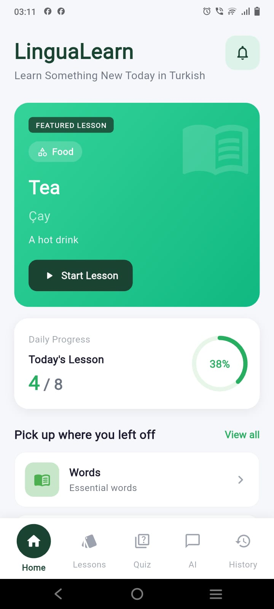
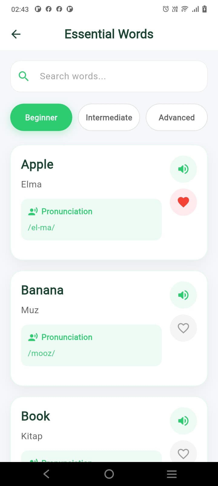
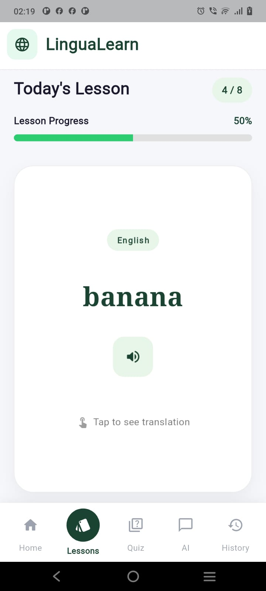
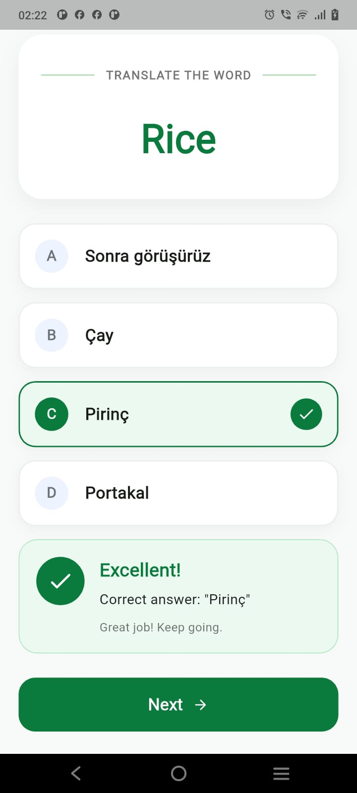
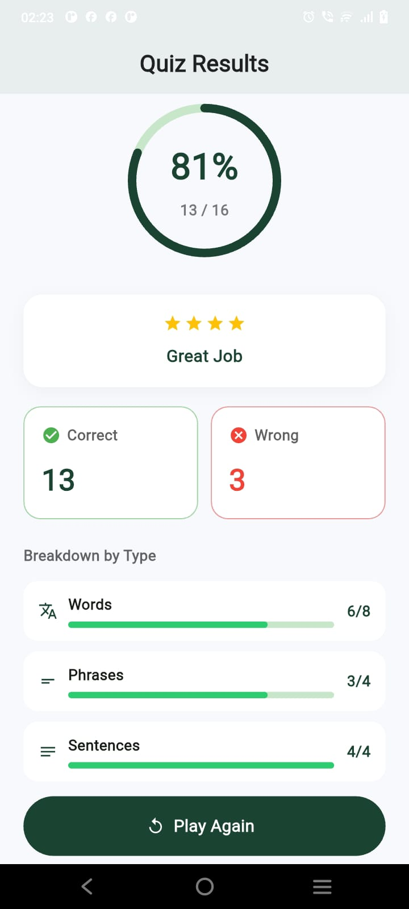
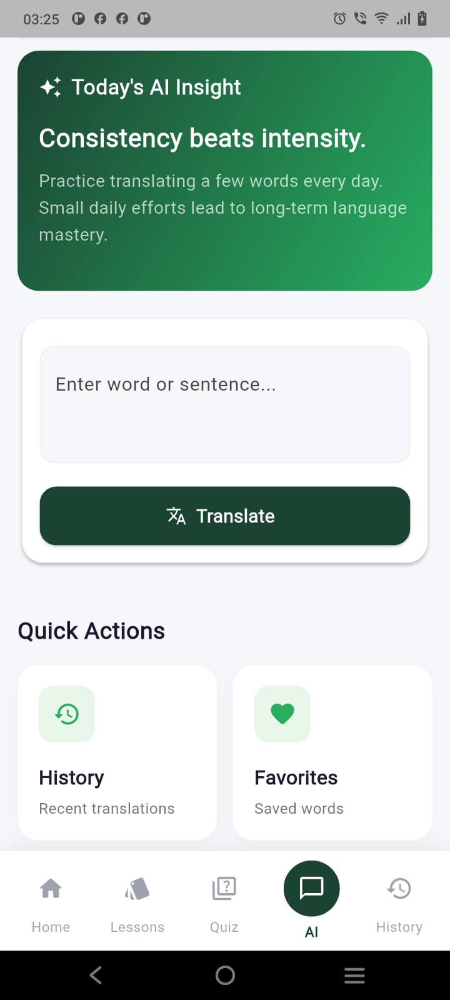
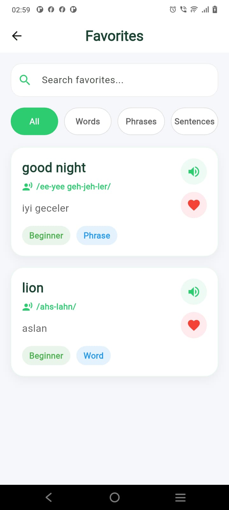
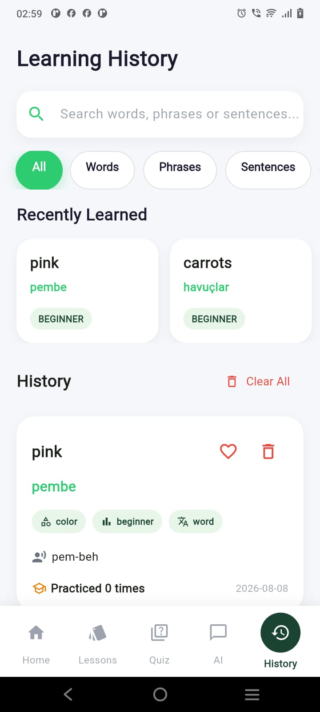

#  LinguaLearn

A modern Flutter language learning application designed to help users learn languages through AI-powered translation, daily lessons, vocabulary practice, quizzes, favorites, and translation history.

The app focuses on making language learning simple, interactive, and engaging through a clean and intuitive user interface.

---

##  Features

-  **AI-Powered Translation**
    - Translate words, phrases, and sentences using AI.
    - Supports contextual translations and language learning assistance.

-  **Essential Vocabulary**
    - Learn commonly used vocabulary.
    - Explore words with translations, pronunciation, meanings, difficulty levels, and examples.

-  **Daily Lessons**
    - Get a new set of learning content each day.
    - Daily lessons include a mixture of words, phrases, and sentences.
    - Track lesson progress and review learned content.

-  **Interactive Quizzes**
    - Test your language knowledge with multiple-choice questions.
    - Questions are based on different content types.
    - Track correct and incorrect answers.

-  **Quiz Results**
    - View quiz score and accuracy.
    - See correct and incorrect answers.
    - View performance breakdown by words, phrases, and sentences.
    - Review mistakes or play the quiz again.

-  **Favorites**
    - Save important words, phrases, and sentences.
    - Search and filter saved content.
    - Quickly review your favorite vocabulary.

-  **Translation History**
    - Keep track of previous translations.
    - Revisit previously translated words, phrases, and sentences.

-  **Offline Local Storage**
    - Stores learning and translation data locally using SQLite/SQFlite.

---
## Screenshots

| Home Screen |                      Essential Vocabulary                      |                     Daily Lessons                     |
|:---:|:--------------------------------------------------------------:|:-----------------------------------------------------:|
|  |  |  |

<br>

| Quiz | Quiz Results |                      AI Translation                      |
|:---:|:---:|:--------------------------------------------------------:|
|  |  |  |
|      |              |                                                          |

<br>

| Favorites | Translation History | |
|:---:|:---:|:---:|
|  |  | |
---

##  Tech Stack

### Frontend
- **Flutter**
- **Dart**

### Architecture
- **MVVM Architecture**
- **GetX State Management**
- Repository Pattern

### Local Database
- **SQFlite**
- SQLite

### AI
- **Google Gemini API**

### Other Technologies
- REST API integration
- Local data persistence
- Flutter testing

---

##  Project Structure

```text
lib/
│
├── constants/
│   └── app_colors.dart
│
├── database/
│   ├── database_helper.dart
│   ├── daily_lesson_table.dart
│   ├── translation_history_table.dart
│   └── ...
│
├── models/
│   ├── daily_lesson_model.dart
│   ├── quiz_model.dart
│   ├── translation_history_model.dart
│   └── ...
│
├── repositories/
│   ├── daily_lesson_repo.dart
│   ├── quiz_repo.dart
│   └── ...
│
├── screens/
│   ├── home_screen.dart
│   ├── ai_screen.dart
│   ├── quiz_screen.dart
│   ├── quiz_result_screen.dart
│   ├── favourite_screen.dart
│   ├── history_screen.dart
│   └── ...
│
├── services/
│   └── gemini_service.dart
│
├── view_models/
│   ├── quiz_vm.dart
│   ├── history_vm.dart
│   └── ...
│
├── widgets/
│   └── ...
│
└── main.dart